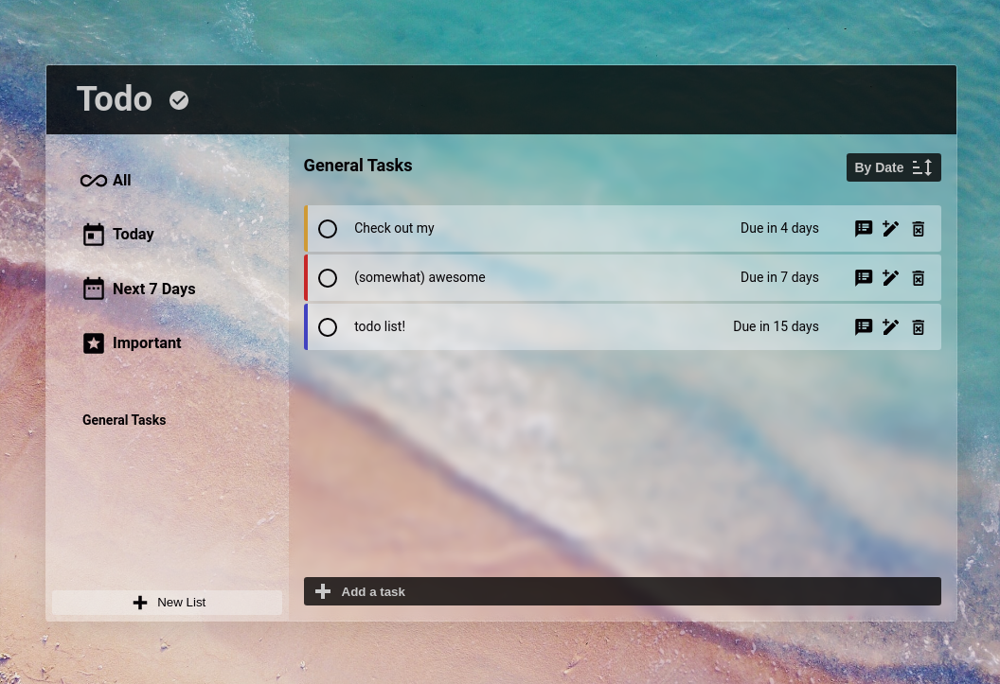

# todo-list

A todo list app built with vanilla HTML, CSS & JS. You can create, edit & delete tasks as well as store them in projects (via localstorage). Has several different sorting options built in and is (hopefully) responsive on PC, tablet and mobile.

[Demo here](https://casssb.github.io/todo-list/)

## Tech Used
* Vanilla HTML, CSS & JS
* Localstorage API
* NPM & Webpack
* Date-fns
* Sanitize CSS (for reset)

## Thoughts
This project seemed to be going super smoothly until I had to build in the functionality for the different sorting options! I’d originally planned the app with an inheritance based OOP structure. I had classes for projects, tasks, static event listeners & dynamic listeners as well as an overall controller for storage state (I’d read up a lot about pub/sub and this made a ton of sense to me). Then came having to fit in the sorting logic and manage state between all the different menu options and projects! I ended up finding that my DOM properties were all becoming tightly coupled so ended up moving them into one module. This then lead me to switching to factory functions for the tasks/projects. It’s been a really helpful learning experience but I need to get better at planning state management. 

## Possible Improvements
* I’m thinking about re-doing some of the styling on the nav menu for mobile screen sizes as I’m not 100% happy with it (I’m never happy with my CSS!)
* When I was planning out the app originally it all looked a whole lot more readable and cleaner when everything was sorted into classes. I feel like I was somewhat successful in keeping my 2 main modules loosely coupled but could have split my DOM module into various smaller modules if I’d managed some of the state better.
*I was trying to be conscious of time complexity when dealing with the sorting logic but have ended up using many n2 loops  (I’d tried to make sure arrays were sorted prior to being iterated over). I’d originally considered having 2x storage arrays (one for projects and another for tasks) but thought having a 2D array would be more logical. If I’d gone with 2x arrays I’d have less overall time complexity I think.

## Credits
* SVG icons from [Material Design](https://materialdesignicons.com/)
* CSS glass effect tool from [css glass](https://css.glass)
* Fluid CSS scaling defaults from [fluid-type-scale.com](https://www.fluid-type-scale.com/)
* project idea from [The Odin Project](https://www.theodinproject.com/lessons/node-path-javascript-todo-list)